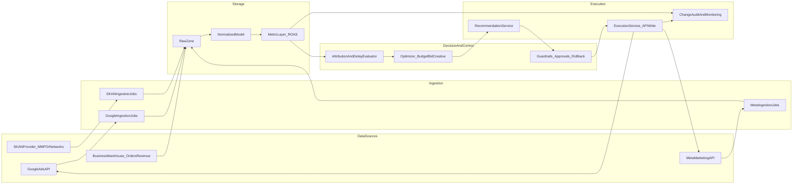

# iOS(Google+Meta)+SKAN4 优化系统架构规划

## 目标与范围
- **主目标**：以 **收入 ROAS** 为核心，对 iOS 投放做预算/结构/素材的持续优化闭环（监控→决策→执行→学习）。
- **平台范围**：Google Ads（iOS App Campaign 等）、Meta（Facebook/Instagram iOS），并引入 **SKAN 4** 作为隐私归因信号源。
- **输出形态**：在本仓库补齐一套“SKAN 评估方案 + 数据契约 + 端到端系统架构（含数据流/模块/护栏/里程碑）”的文档集。

## 关键约束（以广告主视角落地）
- **SKAN 信号可得性**：SKAN postback 原始回传通常在广告网络侧，广告主侧常见落地是“通过 MMP 或广告网络报表拿到聚合数据”。因此架构需提供两种接入形态：
  - **A 路径（推荐）**：MMP/归因平台汇总 SKAN 4 数据 → 统一拉取。
  - **B 路径**：分别从 Google/Meta 的 SKAN 报表能力拉取 → 统一归一。
  - 当前你们的归因栈未定（`unknown`），所以方案将两条路径都纳入，并抽象成同一 `SKANIngestion` 接口。
- **SKAN 4 特性**：多次 postback、coarse conversion value、privacy threshold 导致的缺失/延迟/粒度变化，需要在 MetricLayer 中做延迟对齐与不确定性表达。

## 总体架构（模块分层）

## 数据拉取与数据契约（统一到“广告主指标层”）
- **Google（iOS）拉取**：沿用现有 `google/` 文档思路（Query Service 报表 + Mutate 执行），重点补齐 iOS/SKAN 相关字段在归一模型中的位置。
- **Meta（iOS）拉取**：沿用 `facebook/META_ROAS_OPTIMIZER_PLAN.md` 的闭环，补齐 iOS/SKAN 相关洞察字段与对象映射。
- **SKAN 4 拉取（抽象接口）**：
  - **输入事实**：按 `date x network x app_id x skan_campaign_id x postback_index` 聚合的 installs / conversion_value / coarse_value / source_app_id 等（以可获得字段为准）。
  - **映射维表**：`skan_campaign_id ↔ platform_campaign/adset`（不同网络映射方式不同，需在 `MappingService` 中版本化管理）。
- **统一指标口径**：建立 iOS 专用的 ROAS 口径：
  - 时间窗：按 SKAN window 与平台报表窗口做对齐。
  - 延迟：以 nowcasting/backfill 方式输出 `observed_roas` 与 `expected_roas`（带置信区间）。

## SKAN 评估层（核心差异化能力）
- **CV 映射与版本管理**：设计 `SKANSchemaRegistry`（conversion schema 版本、启用时间、映射规则、回滚策略）。
- **Privacy Threshold 处理**：对缺失/粗粒度的记录用“区间/分布”表达，避免强行点估计。
- **多 postback 融合**：按 postback_index 分层建模，支持滚动更新与回补。
- **与业务收入融合**（可选增强）：若有仓库侧“广告维度可对齐”的收入数据，则用于校正（例如把 SKAN 的 CV 估计收入映射到真实收入分布）。

## 优化执行闭环（Google+Meta 共用）
- **决策层输出**：Recommendation（变更集）包含：目标层级（Campaign/AdSet/Ad）、证据（ROAS 分布、样本量、延迟校正）、风险（学习期/波动/预算约束）、回滚计划。
- **可控杠杆**：
  - **预算分配**：在系列/广告组层按“后验 ROAS 分布 + 约束”做分配（先规则后模型）。
  - **素材/创意**：iOS 侧更依赖早期代理指标（CTR、CVR、add-to-cart 等）+ SKAN early CV 做淘汰/探索。
  - **频控/序列**：在 Meta 侧用受众分层与再营销窗近似序列；在 Google 侧通过系列结构与素材组策略控制。
- **护栏**：变更幅度上限、学习期保护、最小样本量门槛、预算波动限制、自动回滚触发器、人工审批流。

## 仓库交付物（文档结构）
- 新增/补齐以下文档（与现有 `google/`、`facebook/` 风格对齐）：
  - `apple/SKAN_MEASUREMENT_SOLUTION.md`：SKAN 4 评估方案（CV schema、postback、阈值、延迟、口径）。
  - `ios/IOS_UNIFIED_MEASUREMENT_MODEL.md`：Google+Meta+SKAN 的统一数据模型与字段契约（维表/事实表/指标定义）。
  - `ios/OPTIMIZATION_SYSTEM_ARCHITECTURE.md`：广告主视角的优化系统架构（模块、数据流、执行闭环、护栏、里程碑）。
  - 更新 `google/README.md` 与 `facebook/` 索引（必要时新增 `facebook/README.md`），并在仓库根 README（如需）加入总索引。

## 里程碑（按可落地优先级）
- **M1（1-2 周）**：Google+Meta 拉数规范化 + SKAN 接入（A/B 路径二选一先跑通）+ 指标层（ROAS 延迟校正）+ 仅出建议不自动写。
- **M2（2-4 周）**：半自动执行（审批后写入）+ 预算护栏 + iOS 素材探索/淘汰规则。
- **M3（持续）**：更强的实验与因果评估（holdout/geo）+ 预算分配器（bandit/约束优化）+ 多 postback 融合的更稳定 nowcasting。

