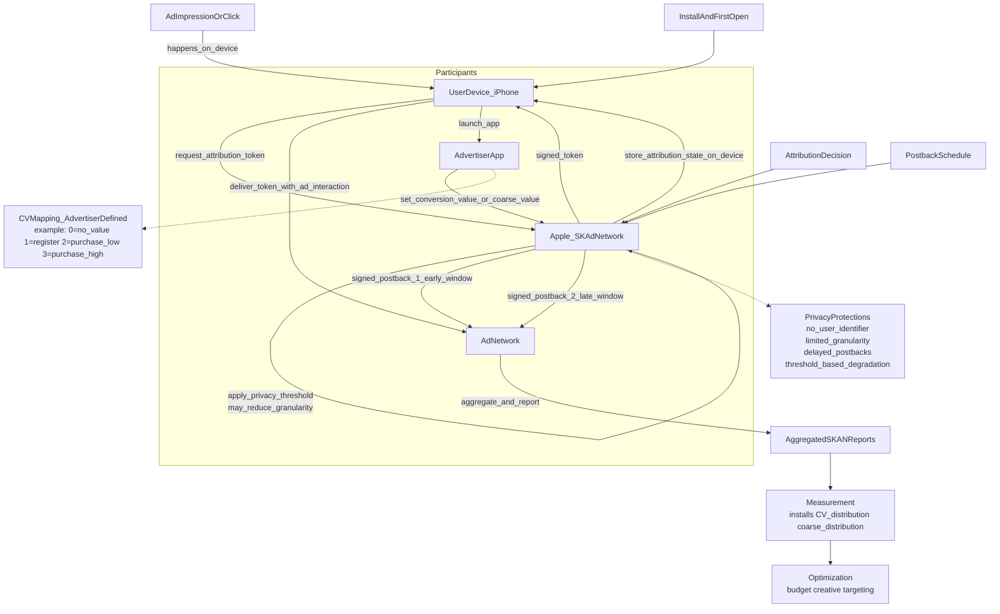

# SKAN 4.0（SKAdNetwork）解读：如何“可评估”又“保隐私”

## 一句话总结
**SKAN 4 的本质**：苹果用“系统签名的归因回执 + 分阶段、分档的转化摘要 + 延迟与阈值降级”替代用户级追踪，让广告商还能做效果评估和优化，但无法识别或追踪到具体个人。

## 核心逻辑（简单明了）
1. **可信归因**：归因回执由 **Apple 签名**，广告网络无法伪造“我带来安装”。  
2. **可用评估**：广告主把用户行为映射为 **conversion value（CV/粗粒度 CV）**，回传的是“分档摘要”而不是用户明细。  
3. **隐私保护**：通过 **限制粒度 + 延迟回传 + 隐私阈值（不足样本则降级/缺失）**，避免“小样本数到人”、避免把回执对齐到某个具体用户。  
4. **分阶段回传**：SKAN 4 支持 **多次 postback**（不同时间窗/不同精度），用来兼顾“更快优化”和“更完整价值评估”。  

## 流程图：从展示到回传再到优化（隐私闸门在哪里）

