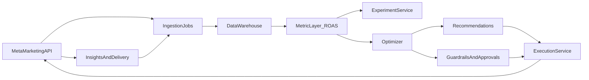

# Meta Marketing API 广告序列与素材优化系统规划（ROAS + 数据仓库）

## 目标与默认假设

- **目标**: 以 **ROAS（转化价值/花费）** 为核心做预算与素材决策。
- **默认“序列”定义**: 先做**漏斗级编排**（拉新/再营销/复购），在再营销阶段进一步用**时间窗 + 受众规则**近似“用户级触达顺序”。（真实用户级顺序受平台标识/隐私约束，通常通过受众分层与频控来实现。）
- **权威对象模型依据**: Campaign / AdSet / AdCreative / Ad 与其职责划分见 Meta Marketing API 概览（[Marketing API Overview](https://developers.facebook.com/docs/marketing-api/overview)）。

## 系统要解决的核心问题

- **素材优化**: 发现/生成候选创意（图/视频/文案/落地页组合），并持续替换低效素材。
- **序列优化**: 不同漏斗阶段使用不同“信息点/创意池/频控与预算”，并在再营销中做“先教育→后转化”的规则化序列。
- **预算与结构优化**: 在 Campaign/AdSet 层做预算分配与出价策略，使 ROAS 最大化并满足花费/波动约束。
- **闭环学习**: 用数据仓库的订单/利润/退货等信号修正平台内指标偏差，形成“业务视角”的优化。

## 能力边界与关键约束（决定落地方式）

- **创意不可变**: AdCreative 创建后通常不可编辑，优化主要体现为“创建新创意/新广告并替换/暂停旧广告”。（概览中已说明 creative 一旦创建不可变。）
- **学习期与延迟**: 转化有延迟，ROAS 需要按转化窗口与回传延迟做校正；必须引入“冷启动保护”和“样本量门槛”。
- **可控杠杆**:
  - 结构：Campaign objective、AdSet 受众/版位/优化事件/预算/排期
  - 素材：AdCreative 与 Ad 层的组合与上架节奏
  - 运营：暂停/恢复/删除，基于规则或模型触发（可结合 Ad Rules Engine）

## 总体架构（数据→决策→执行）

## 数据层设计（仓库为真相源）

- **数据输入**:
  - Meta 投放侧：花费、展示、点击、转化/价值、频次、版位等（通过 Insights 类接口拉取）。
  - 业务侧（仓库）：订单金额/毛利/退款、LTV、用户分群、库存/价格等。
- **统一键（identity）策略**（按可得性从强到弱）:
  - 强：订单级/事件级与 `campaign_id/adset_id/ad_id` 对齐（UTM、click id、server-side event params 等）。
  - 弱：聚合到日×广告层级（无法事件级对齐时采用）。
- **核心指标层（MetricLayer）**:
  - ROAS、边际 ROAS（mROAS）、增量 ROAS（iROAS，若有对照）、利润 ROAS（pROAS）。
  - 不确定性：置信区间/后验分布（为 bandit 与预算分配服务）。

## 优化逻辑：两层决策（预算/结构 与 素材/序列）

### 1) 预算与结构优化（AdSet 级为主）

- **输入**: 近 N 天稳定窗口（含延迟校正）的 ROAS 后验分布、花费弹性、受众重叠约束。
- **策略**:
  - 多臂老虎机（Thompson Sampling / UCB）做 AdSet 间预算分配。
  - 约束优化：
    - 最小/最大日预算
    - 花费日波动（避免学习期频繁重置）
    - 业务约束（库存/毛利门槛）
- **输出**: `update` 预算/排期/状态（或给出人工审批建议）。

### 2) 素材与序列优化（Ad/Creative 级为主）

- **创意候选生成**:
  - 创意维度标签化：卖点（价格/品质/口碑/场景）、形式（图/视频/轮播）、长度、落地页类型。
  - 从赢家创意抽象“可复用元素”，生成新组合（规则优先，后续可引入 LLM 辅助但必须有审核门）。
- **上架与淘汰机制**:
  - 冷启动保护：新创意先进入探索池，设最小花费/最小展示阈值。
  - 淘汰：连续 K 个窗口低于基线（含统计显著性或后验概率阈值）则暂停。
- **序列（漏斗级 + 再营销窗）**:
  - 拉新：教育/卖点广覆盖（更大创意池，探索占比更高）。
  - 再营销（核心序列）:
    - 窗口1（0-3天）：证据型素材（口碑/对比/FAQ）
    - 窗口2（4-7天）：利益点强化（优惠/套装/稀缺）
    - 窗口3（8-14天）：强转化（限时/再激活）
  - 通过受众分层 + 频控 + 素材池绑定实现“近似触达顺序”。

## 执行层：API 与自动化工作流

- **拉取**: 定时拉取结构（campaign/adset/ad/creative）与 Insights。
- **决策**: 生成 recommendations（变更集），并记录“原因/证据/风险”。
- **写入**:
  - 创建新 AdCreative / 新 Ad（替换低效素材）
  - 更新 AdSet 预算/排期/状态
  - 暂停/恢复（必要时使用规则引擎进行快速止损）
- **安全机制**:
  - 变更配额与节流（rate limit）
  - 审批流（高预算/大幅度调整必须人工确认）
  - 回滚：保留上一版本结构与素材映射，支持一键回退

## 实验设计（让 ROAS 结论更可信）

- **最低配**: 广告组内 A/B（创意对照）+ 统计门槛。
- **进阶（推荐，因你们有仓库）**:
  - 地域/人群分层 holdout（增量/对照）
  - 预算阶梯实验（估计 mROAS 曲线）
- **出厂标准**: 每个结论都要附带样本量、窗口、归因口径、置信区间。

## 在本仓库的交付物（文档化 + 可执行规格）

- 在 `facebook/` 目录新增三份“对齐现有 google 文档风格”的材料：
  - `facebook/FACEBOOK_MARKETING_API_CAPABILITIES.md`: 面向系统设计需要的 API 能力清单（对象模型、常用字段、读/写能力、限制）。
  - `facebook/AD_AND_ASSET_OPTIMIZATION_ARCHITECTURE_FACEBOOK.md`: 系统架构、数据流、模块职责、序列与素材策略。
  - `facebook/OPTIMIZATION_QUICK_GUIDE_FACEBOOK.md`: 运营/投放人员可用的执行手册（阈值、节奏、排错）。
- `README.md` 增加索引：google / facebook 两条线并列。

## 里程碑（建议）

- M1（1-2周）: 数据打通 + 指标层 + 手动建议（不自动写入）。
- M2（2-4周）: 半自动执行（审批后写入）+ 创意探索/淘汰。
- M3（持续）: 增量实验 + 预算分配器 + 更精细序列策略。

