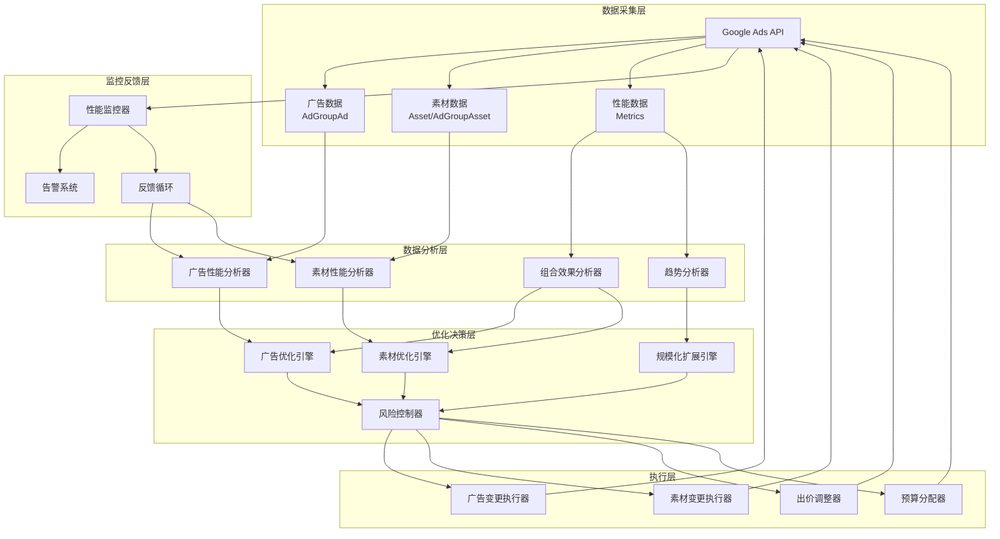
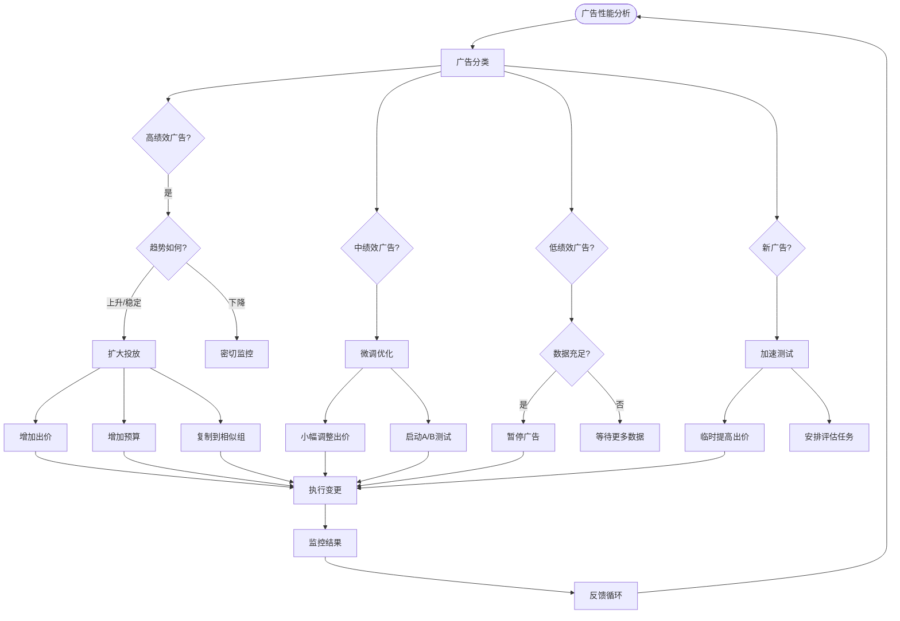
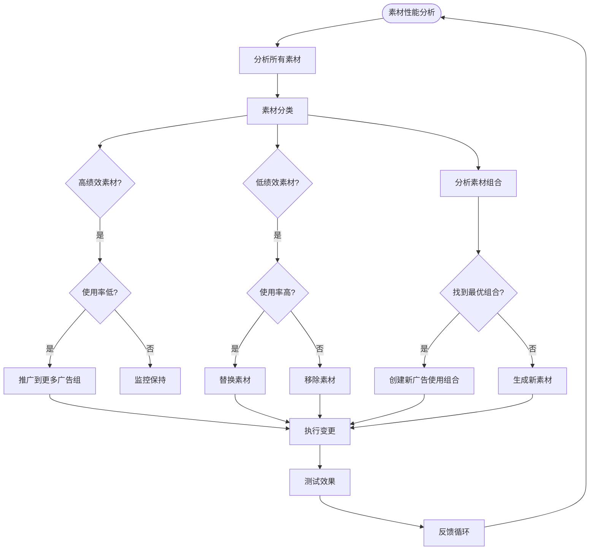
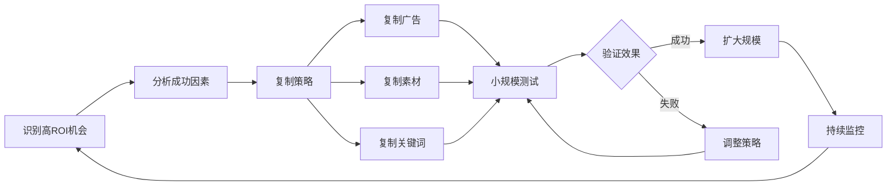
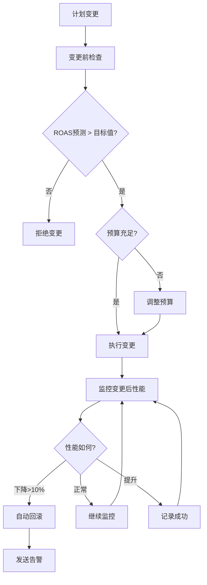
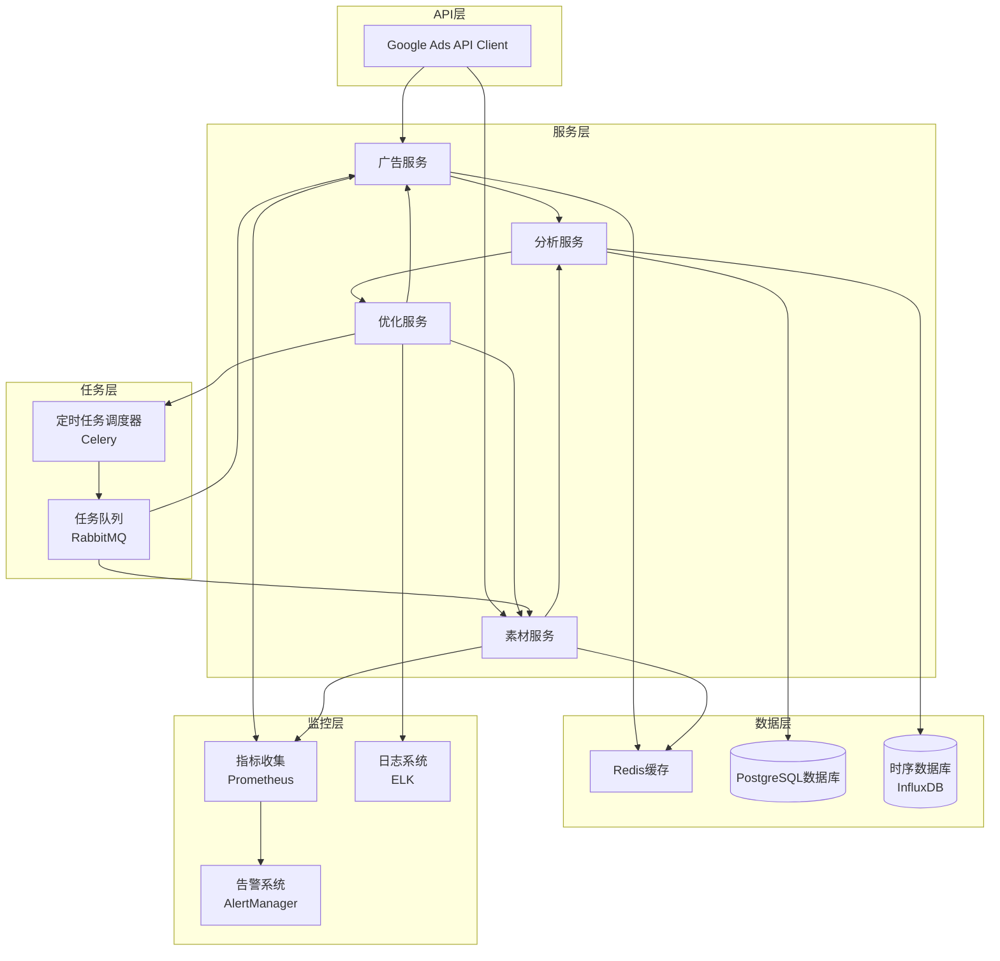
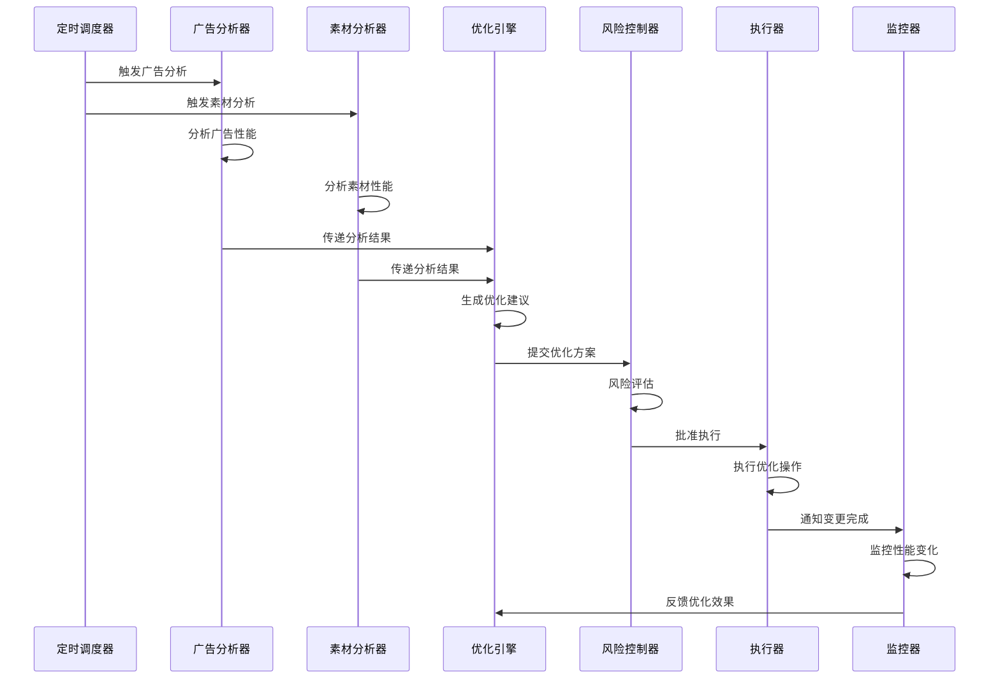
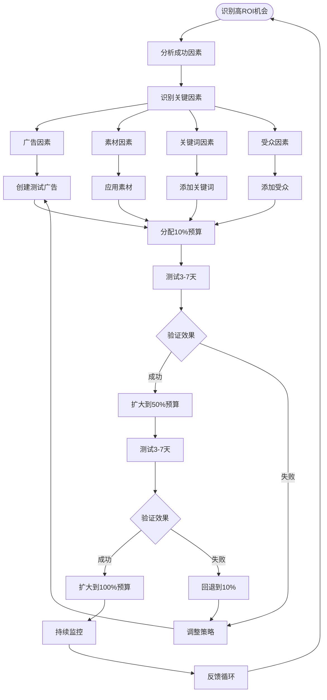

# 广告优化与素材优化系统架构设计

## 一、设计目标

### 1.1 核心目标
- **提高优化效率**：自动化识别优化机会，减少人工干预
- **最大化符合目标的花费**：在满足ROAS/CPA等KPI的前提下，找到更多高ROI机会并扩大投放规模

### 1.2 优化原则
1. **数据驱动**：基于真实性能数据做决策
2. **快速迭代**：缩短优化周期，快速响应市场变化
3. **规模化扩展**：识别高ROI机会后快速扩大投放
4. **风险控制**：在扩大投放时保持目标KPI

## 二、系统架构概览



## 三、广告优化模块设计

### 3.1 广告性能分析器（AdAnalyzer）

#### 核心功能
1. **多维度性能分析**
   - 使用资源：`AdGroupAd`（带指标）
   - 分析维度：
     - 广告级别：CTR、转化率、ROAS、CPA
     - 时间维度：日/周/月趋势
     - 设备维度：桌面/移动/平板性能
     - 受众维度：不同受众的表现

2. **广告分类**
   - **高绩效广告**：ROAS > 目标值 * 1.2，转化数 >= 阈值
   - **中绩效广告**：ROAS 在目标值 ± 20% 范围内
   - **低绩效广告**：ROAS < 目标值 * 0.8，或转化数 = 0 且点击 > 阈值
   - **新广告**：投放时间 < 7天，数据不足

3. **性能趋势识别**
   - 上升趋势：最近7天ROAS > 前7天ROAS * 1.1
   - 下降趋势：最近7天ROAS < 前7天ROAS * 0.9
   - 稳定趋势：ROAS波动在 ±10% 范围内

#### 数据采集策略
```python
# 伪代码示例
def analyze_ad_performance():
    # 查询广告性能数据
    query = """
    SELECT 
        ad_group_ad.ad.id,
        ad_group_ad.ad.type,
        ad_group_ad.ad.final_urls,
        metrics.impressions,
        metrics.clicks,
        metrics.conversions,
        metrics.cost_micros,
        metrics.ctr,
        metrics.conversion_rate,
        metrics.value_per_conversion,
        segments.date,
        segments.device,
        segments.ad_network_type
    FROM ad_group_ad
    WHERE segments.date DURING LAST_30_DAYS
    """
    
    # 按广告分组聚合
    # 计算ROAS = (conversions * value_per_conversion) / cost
    # 识别趋势和分类
```

### 3.2 广告优化引擎（AdOptimizer）

#### 优化策略

**策略1：低绩效广告快速淘汰**
- **触发条件**：
  - ROAS < 目标值 * 0.7
  - 转化数 = 0 且点击 >= 20
  - 投放时间 >= 7天（有足够数据）
- **执行动作**：
  - 暂停广告（通过 `AdGroupAd` 更新状态）
  - 记录原因供后续分析

**策略2：高绩效广告扩大投放**
- **触发条件**：
  - ROAS > 目标值 * 1.3
  - 转化数 >= 5
  - 趋势：上升或稳定
- **执行动作**：
  - 增加广告组出价（通过 `AdGroup` 更新）
  - 增加预算分配（通过 `CampaignBudget`）
  - 复制到相似广告组（通过 `Ad` 创建）

**策略3：中绩效广告微调优化**
- **触发条件**：
  - ROAS 在目标值 ± 20% 范围内
  - 有转化但未达到最优
- **执行动作**：
  - 小幅调整出价（±10%）
  - A/B测试不同创意组合
  - 优化落地页（如果可访问）

**策略4：新广告加速测试**
- **触发条件**：
  - 投放时间 < 7天
  - 展示次数 < 1000
- **执行动作**：
  - 临时提高出价以获取更多数据
  - 设置7天后的自动评估任务

#### 优化决策流程



### 3.3 广告变更执行器（AdMutator）

#### 批量操作优化
- 使用 `BatchJob` 进行大规模变更
- 原子性操作确保一致性
- 变更前验证，变更后确认

#### 执行优先级
1. **高优先级**：暂停低绩效广告（立即执行）
2. **中优先级**：出价调整（批量执行）
3. **低优先级**：广告复制（异步执行）

## 四、素材优化模块设计

### 4.1 素材性能分析器（AssetAnalyzer）

#### 核心功能
1. **素材类型分析**
   - 使用资源：`Asset`、`AdGroupAsset`、`AdGroupAdAssetView`
   - 素材类型：
     - 文本素材（标题、描述）
     - 图片素材
     - 视频素材
     - 结构化片段

2. **素材性能评估**
   - **高绩效素材**：
     - 使用该素材的广告ROAS > 平均ROAS * 1.2
     - 展示次数占比高且转化率好
   - **低绩效素材**：
     - 使用该素材的广告ROAS < 平均ROAS * 0.8
     - 展示次数少且无转化

3. **素材组合效果分析**
   - 使用资源：`AdGroupAdAssetCombinationView`
   - 分析不同素材组合的效果
   - 识别最优素材组合

#### 数据采集策略
```python
# 伪代码示例
def analyze_asset_performance():
    # 查询素材性能数据
    query = """
    SELECT 
        asset.id,
        asset.type,
        asset.text_asset.text,
        asset.image_asset.full_size_image_url,
        ad_group_ad_asset_view.field_type,
        metrics.impressions,
        metrics.clicks,
        metrics.conversions,
        metrics.cost_micros
    FROM ad_group_ad_asset_view
    WHERE segments.date DURING LAST_30_DAYS
    """
    
    # 按素材分组聚合
    # 计算素材ROAS
    # 分析素材组合效果
```

### 4.2 素材优化引擎（AssetOptimizer）

#### 优化策略

**策略1：低绩效素材替换**
- **触发条件**：
  - 素材ROAS < 平均ROAS * 0.7
  - 使用该素材的广告数量 >= 3
  - 展示次数 >= 1000
- **执行动作**：
  - 从低绩效广告中移除素材（通过 `AdGroupAsset` 删除）
  - 用高绩效素材替换（通过 `AdGroupAsset` 创建）

**策略2：高绩效素材推广**
- **触发条件**：
  - 素材ROAS > 平均ROAS * 1.3
  - 使用该素材的广告数量 < 5
- **执行动作**：
  - 将素材添加到更多广告组（通过 `AdGroupAsset` 创建）
  - 优先在相似广告组中使用

**策略3：素材组合优化**
- **触发条件**：
  - 识别到高ROAS的素材组合
  - 该组合使用率低
- **执行动作**：
  - 创建新的广告，使用该素材组合（通过 `Ad` 和 `AdGroupAsset`）
  - 测试不同组合的效果

**策略4：AI素材生成和测试**
- **触发条件**：
  - 素材库中某类型素材数量 < 5
  - 或需要新创意方向
- **执行动作**：
  - 使用 `AssetGenerationService`（测试中）生成新素材
  - 创建测试广告使用新素材
  - 监控性能，保留高绩效素材

#### 素材优化流程



### 4.3 素材变更执行器（AssetMutator）

#### 素材库管理
- 维护素材库（通过 `Asset` 资源）
- 素材标签和分类
- 素材性能追踪

#### 素材复用策略
- 识别可复用的高绩效素材
- 跨广告组/系列复用
- 避免重复创建相同素材

## 五、规模化扩展引擎

### 5.1 扩展机会识别

#### 识别高ROI机会
1. **高绩效广告扩展**
   - 识别ROAS > 目标值 * 1.3的广告
   - 分析成功因素（关键词、受众、素材、时段等）
   - 复制到相似场景

2. **高绩效素材扩展**
   - 识别高ROAS素材
   - 应用到更多广告组
   - 测试不同组合

3. **高绩效关键词扩展**
   - 识别高转化关键词
   - 扩展到相关广告组
   - 测试不同匹配类型

#### 扩展策略



### 5.2 预算分配优化

#### 预算分配策略
1. **基于ROAS的预算分配**
   - 高ROAS广告组 → 增加预算
   - 低ROAS广告组 → 减少预算
   - 目标：在保持整体ROAS的前提下最大化花费

2. **动态预算调整**
   - 实时监控预算使用率
   - 高ROAS组预算即将耗尽 → 自动增加
   - 低ROAS组预算剩余 → 转移到高ROAS组

#### 预算分配算法
```
目标：最大化总转化价值，同时满足整体ROAS目标

1. 计算每个广告组的ROAS
2. 按ROAS排序
3. 分配预算：
   - 高ROAS组：分配更多预算（最高到上限）
   - 中ROAS组：保持当前预算
   - 低ROAS组：减少预算（最低到下限）
4. 验证整体ROAS是否满足目标
5. 如果不满足，调整分配比例
```

### 5.3 出价策略优化

#### 出价调整策略
1. **高绩效广告出价提升**
   - ROAS > 目标值 * 1.3 → 提高出价10-20%
   - 目标：获取更多展示和转化

2. **低绩效广告出价降低**
   - ROAS < 目标值 * 0.8 → 降低出价10-20%
   - 目标：减少无效花费

3. **使用智能出价策略**
   - 使用 `BiddingStrategy`（目标ROAS/目标CPA）
   - 让系统自动优化出价

## 六、风险控制模块

### 6.1 风险控制器（RiskController）

#### 风险检查点
1. **变更前检查**
   - 验证变更不会导致ROAS下降
   - 检查预算限制
   - 验证账户状态

2. **变更后监控**
   - 监控变更后的性能
   - 如果性能下降，自动回滚
   - 设置告警阈值

#### 风险控制策略



### 6.2 告警系统

#### 告警规则
1. **性能下降告警**
   - ROAS下降 > 10%
   - 转化数突然下降
   - 花费异常增加

2. **预算告警**
   - 预算使用率 > 90%
   - 预算即将耗尽

3. **变更失败告警**
   - API调用失败
   - 变更被拒绝

## 七、优化效率提升策略

### 7.1 数据采集优化

#### 批量查询优化
- 使用 `BatchJob` 进行大规模数据查询
- 缓存常用数据，减少API调用
- 增量更新，只查询变更的数据

#### 查询频率策略
- **实时监控**：关键指标（ROAS、预算使用率）每15分钟查询
- **日常分析**：广告和素材性能每小时查询
- **深度分析**：每周进行完整数据分析

### 7.2 决策自动化

#### 自动化规则引擎
1. **规则优先级**
   - P0：立即执行（暂停低绩效广告）
   - P1：批量执行（出价调整）
   - P2：计划执行（素材替换）

2. **规则冲突处理**
   - 多个规则同时触发时，按优先级执行
   - 记录所有规则执行日志

### 7.3 并行处理

#### 并行优化策略
- 广告优化和素材优化并行执行
- 不同广告组的优化并行处理
- 使用异步任务处理耗时操作

## 八、最大化符合目标花费的策略

### 8.1 识别扩展机会

#### 机会识别维度
1. **广告维度**
   - 高ROAS广告 → 复制到相似广告组
   - 高转化广告 → 增加预算和出价

2. **素材维度**
   - 高绩效素材 → 应用到更多广告
   - 最优素材组合 → 创建新广告

3. **关键词维度**
   - 高转化关键词 → 扩展到相关广告组
   - 搜索词机会 → 添加为新关键词

4. **受众维度**
   - 高ROAS受众 → 应用到更多广告组
   - 相似受众 → 创建新受众列表

### 8.2 渐进式扩展

#### 扩展流程
```
1. 小规模测试（10%预算）
   ↓
2. 验证效果（3-7天）
   ↓
3. 如果成功 → 扩大规模（50%预算）
   ↓
4. 再次验证（3-7天）
   ↓
5. 如果成功 → 全量扩展（100%预算）
   ↓
6. 持续监控和优化
```

### 8.3 预算分配优化

#### 预算分配算法
```python
def optimize_budget_allocation(campaigns, target_roas, total_budget):
    """
    在满足整体ROAS目标的前提下，最大化花费
    """
    # 1. 计算每个系列的ROAS
    campaign_roas = {}
    for campaign in campaigns:
        roas = campaign.conversion_value / campaign.cost
        campaign_roas[campaign.id] = roas
    
    # 2. 按ROAS排序
    sorted_campaigns = sorted(campaigns, 
                             key=lambda x: campaign_roas[x.id], 
                             reverse=True)
    
    # 3. 分配预算
    allocated_budget = 0
    for campaign in sorted_campaigns:
        roas = campaign_roas[campaign.id]
        
        if roas >= target_roas * 1.2:
            # 高ROAS：分配更多预算
            budget = min(campaign.current_budget * 1.5, 
                        campaign.max_budget)
        elif roas >= target_roas:
            # 达标ROAS：保持或小幅增加
            budget = campaign.current_budget * 1.1
        elif roas >= target_roas * 0.8:
            # 接近目标：保持预算
            budget = campaign.current_budget
        else:
            # 低ROAS：减少预算
            budget = campaign.current_budget * 0.8
        
        campaign.allocated_budget = budget
        allocated_budget += budget
    
    # 4. 如果总预算未用完，分配给高ROAS系列
    remaining_budget = total_budget - allocated_budget
    if remaining_budget > 0:
        for campaign in sorted_campaigns:
            if campaign_roas[campaign.id] >= target_roas * 1.2:
                additional = min(remaining_budget, 
                                campaign.max_budget - campaign.allocated_budget)
                campaign.allocated_budget += additional
                remaining_budget -= additional
                if remaining_budget <= 0:
                    break
    
    return campaigns
```

## 九、系统实现架构

### 9.1 技术架构



### 9.2 核心服务设计

#### 广告优化服务
```python
class AdOptimizationService:
    def __init__(self):
        self.analyzer = AdPerformanceAnalyzer()
        self.optimizer = AdOptimizer()
        self.mutator = AdMutator()
        self.risk_controller = RiskController()
    
    def optimize_ads(self, ad_group_id):
        # 1. 分析广告性能
        ad_performance = self.analyzer.analyze(ad_group_id)
        
        # 2. 生成优化建议
        optimizations = self.optimizer.generate_optimizations(ad_performance)
        
        # 3. 风险检查
        approved_optimizations = self.risk_controller.validate(optimizations)
        
        # 4. 执行优化
        results = self.mutator.execute(approved_optimizations)
        
        # 5. 返回结果
        return results
```

#### 素材优化服务
```python
class AssetOptimizationService:
    def __init__(self):
        self.analyzer = AssetPerformanceAnalyzer()
        self.optimizer = AssetOptimizer()
        self.mutator = AssetMutator()
        self.risk_controller = RiskController()
    
    def optimize_assets(self, campaign_id):
        # 1. 分析素材性能
        asset_performance = self.analyzer.analyze(campaign_id)
        
        # 2. 分析素材组合
        combinations = self.analyzer.analyze_combinations(campaign_id)
        
        # 3. 生成优化建议
        optimizations = self.optimizer.generate_optimizations(
            asset_performance, combinations
        )
        
        # 4. 风险检查
        approved_optimizations = self.risk_controller.validate(optimizations)
        
        # 5. 执行优化
        results = self.mutator.execute(approved_optimizations)
        
        # 6. 返回结果
        return results
```

## 十、优化工作流

### 10.1 日常优化流程



### 10.2 规模化扩展流程



## 十一、关键指标和KPI

### 11.1 优化效率指标
- **优化响应时间**：从发现问题到执行优化的时间
- **自动化率**：自动化执行的优化操作占比
- **优化成功率**：优化后ROAS提升的广告占比

### 11.2 花费效率指标
- **总花费**：在符合目标ROAS前提下的总花费
- **ROAS**：广告支出回报率
- **CPA**：每次转化费用
- **转化价值**：总转化价值

### 11.3 规模化指标
- **扩展速度**：从识别机会到全量扩展的时间
- **扩展成功率**：扩展后仍保持高ROAS的比例
- **预算利用率**：实际花费/总预算

## 十二、实施建议

### 12.1 分阶段实施

**阶段1：基础优化（1-2周）**
- 实现广告性能分析
- 实现低绩效广告自动暂停
- 实现基础告警

**阶段2：素材优化（2-3周）**
- 实现素材性能分析
- 实现素材替换和推广
- 实现素材组合分析

**阶段3：规模化扩展（3-4周）**
- 实现扩展机会识别
- 实现预算分配优化
- 实现渐进式扩展流程

**阶段4：高级优化（持续）**
- 实现AI素材生成
- 实现预测性优化
- 实现更复杂的优化策略

### 12.2 关键成功因素
1. **数据质量**：确保数据采集的准确性和及时性
2. **风险控制**：建立完善的风险控制机制
3. **持续监控**：建立反馈循环，持续优化
4. **渐进式扩展**：避免激进扩展导致性能下降

---

**总结**：本架构设计专注于广告优化和素材优化两个核心维度，通过数据驱动的自动化优化，在保持目标ROAS的前提下，最大化符合目标的花费。系统采用模块化设计，支持渐进式实施和持续优化。

