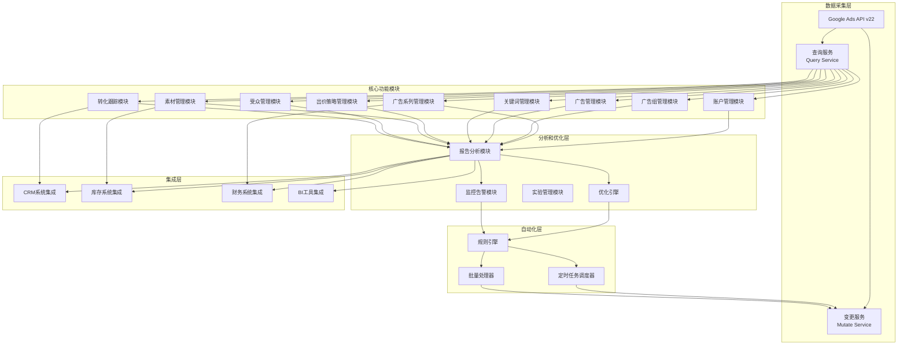
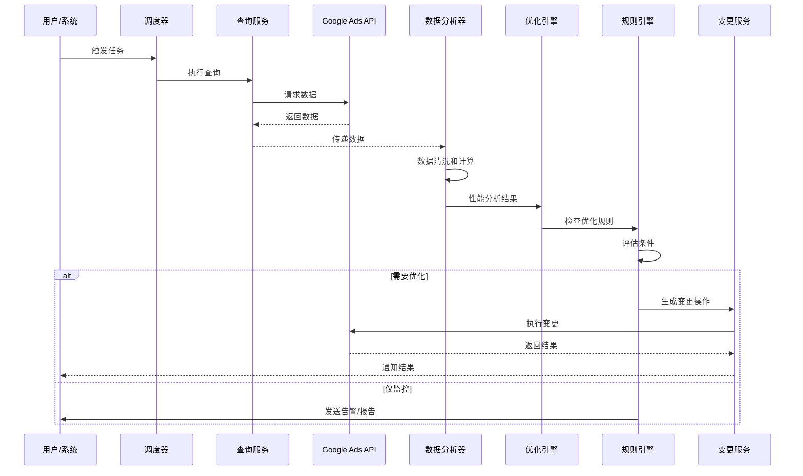
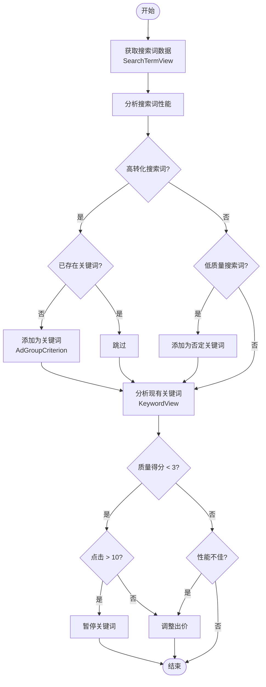
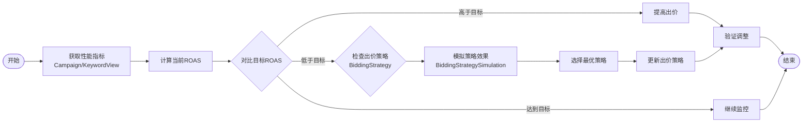
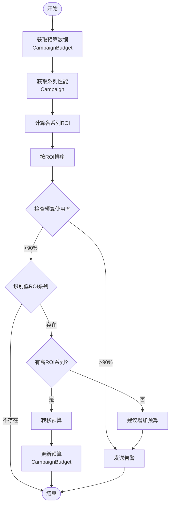
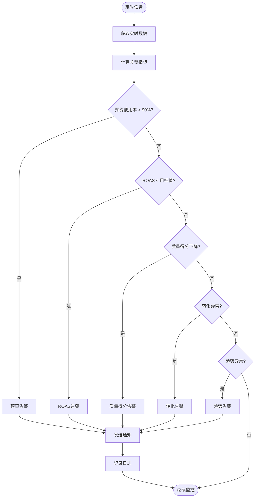
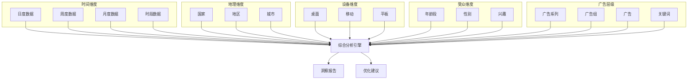
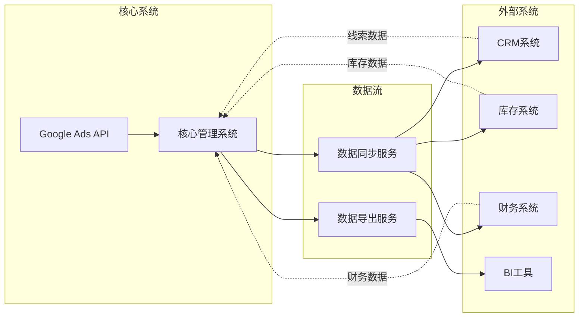
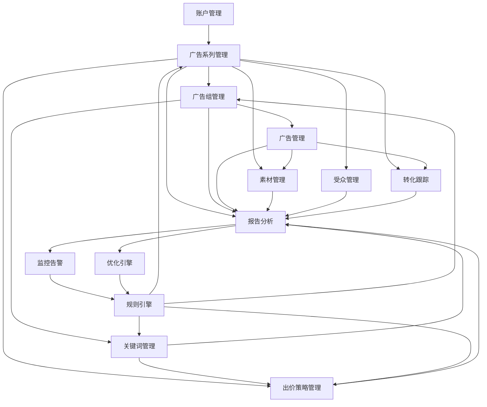
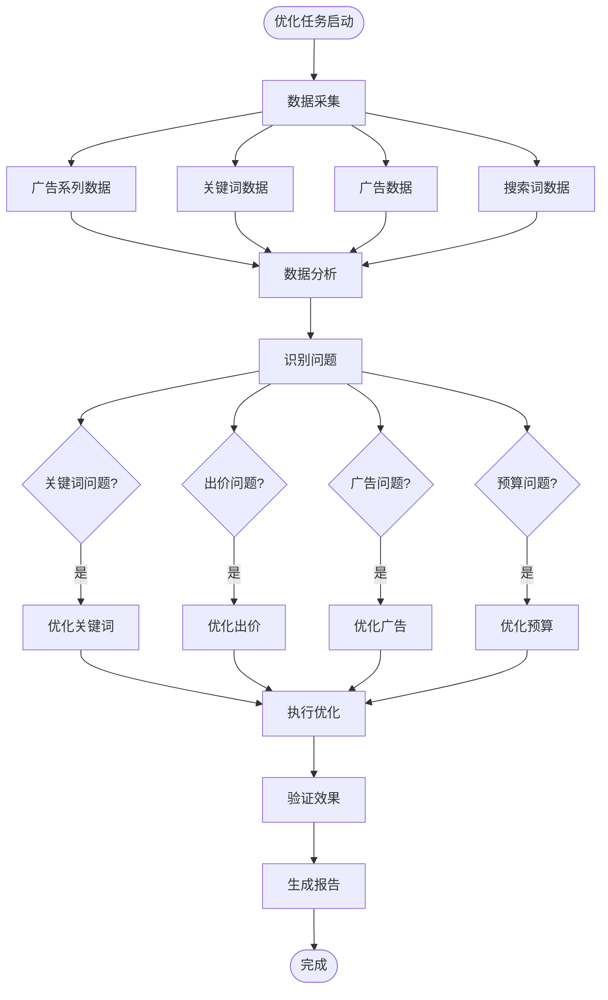

# Google Ads API v22 方案架构可视化

## 一、系统架构图

## 二、数据流向图

## 三、关键词自动优化流程图

## 四、出价自动调整流程图

## 五、预算自动分配流程图

## 六、监控告警流程图

## 七、多维度分析矩阵图

## 八、系统集成架构图

## 九、功能模块依赖关系图

## 十、典型优化场景流程图

---

这些架构图展示了基于 Google Ads API v22 的完整广告管理、优化和监控系统的设计思路和各个模块之间的关系。

